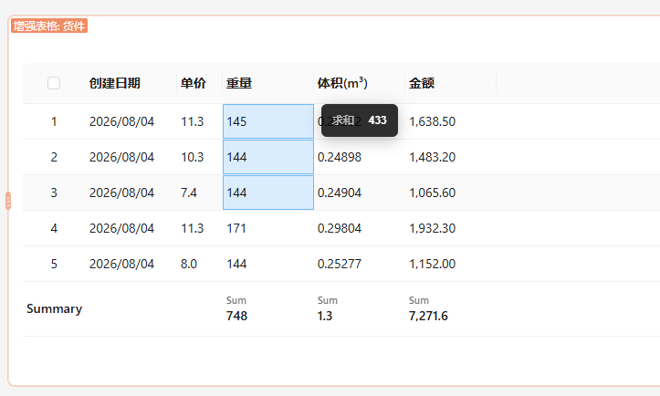
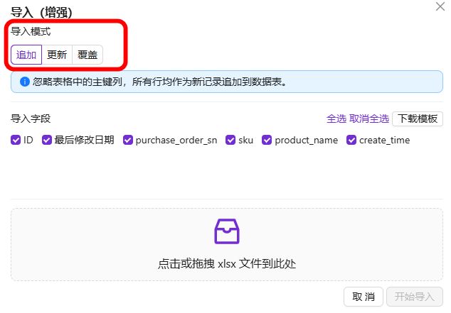
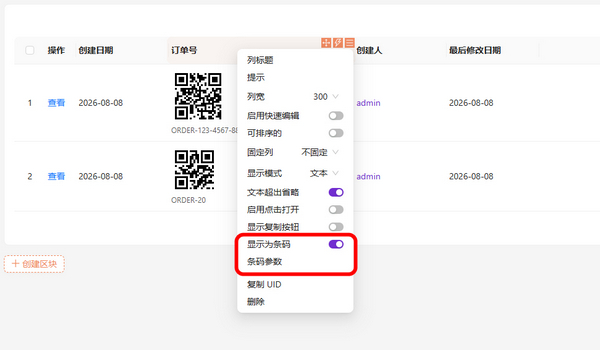

# NocoBase 增强插件集

本仓库包含相互独立、面向 [NocoBase](https://www.nocobase.com/) 2.x 的增强插件小项目，由AI开发。

## 插件总览

| 子项目 | 名称 | 说明 | 示意图 |
| --- | --- | --- | --- |
| [`plugin-enhanced-table`](./plugin-enhanced-table/README.md) | 增强表格 | 底部数值汇总行（求和/平均/最大/最小/计数）+ 拖选统计 |  |
| [`plugin-import-export-enhancement`](./plugin-import-export-enhancement/README.md) | 导入/导出增强 | 追加/更新/覆盖三模式导入；导出筛选后的数据/整个数据表数据 |  |
| [`plugin-verification-code`](./plugin-verification-code/README.md) | 图片验证码 | 本地生成字符/算术验证码，保护登录/注册/忘记密码/公开表单，零第三方 API 依赖 |  |
| [`plugin-field-barcode`](./plugin-field-barcode/README.md) | 字段值条码显示 | 可将字段值显示为条形码/二维码 |  |

## 备注

所有插件共享同一套 NocoBase 2.x 插件骨架：

- **NocoBase 版本**：均要求 `@nocobase/*@2.x`。
- **v1 / v2 版本**：包含旧版 `@nocobase/client`（v1）与新版 `@nocobase/client-v2`，尽可能兼容不同版本的 UI，后续对v1版本可能不再支持，呼吁各位走 Nocobase的 `/v` 分支 

插件彼此独立，可单独启用，互不依赖，本项目全部或部分由人工智能（AI）辅助生成。

---

## 下载
https://github.com/simousa/nocobase-plugin/releases
