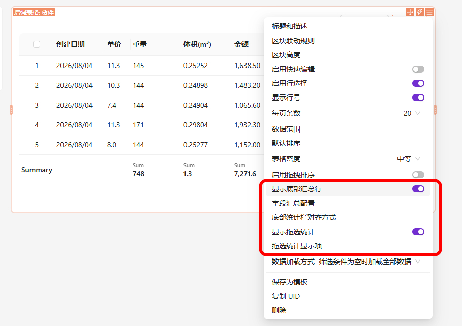
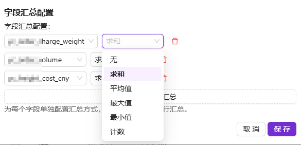

# @simo/plugin-enhanced-table

> 增强表格区块 —— 为 NocoBase 表格区块增加「底部汇总行」与「拖选统计」两类数据分析能力，让用户在表格里就能像 Excel 一样快速计算。

## 简介

`@simo/plugin-enhanced-table` 是 NocoBase 2.x 的一个区块增强插件。它在官方表格区块（`TableBlockModel`）的基础上派生出新的 **Enhanced Table（增强表格）** 区块，提供了两类面向数据分析的增强：

1. **底部汇总行（Footer Summary）**：按字段单独配置汇总方式（求和 / 平均值 / 最大值 / 最小值 / 计数 / 无），所有配置汇总的字段共享一行底栏，更贴合 Excel 「总计行」的使用习惯；同时支持左对齐 / 居中 / 右对齐（默认左对齐）。
2. **拖选统计（Selection Stats）**：用鼠标在表格上拖拽框选单元格，仿 Excel 状态栏实时弹出统计（计数、数值计数、求和、平均、最大、最小）。

两类能力均可在区块设置中独立开关，并选择需要显示的统计项。

---

## 效果图

## 功能特性

- **数值列自动识别**：根据集合字段的 `type`（integer / float / decimal / percent …）或界面类型（integer / number / percent）自动判断是否为数值列，仅对数值列做求和 / 平均 / 最大 / 最小。
- **按字段配置的底部汇总行**：利用 antd `Table.Summary` 渲染固定底栏，与列对齐；每个字段可独立选择汇总方式（`sum` / `average` / `max` / `min` / `count` / `none`），所有字段共享同一行底栏；`count` 对任意字段都生效（统计非空值数量）。底栏数值默认左对齐，可在设置中切换为居中 / 右对齐。
- **拖选统计浮层**：鼠标按下拖拽框选，自动高亮选中单元格，在右上角浮层中显示统计结果；兼容文本、日期、含字母的编号（非纯数字会被忽略）。
- **Excel 状态栏语义**：`SelectionStatsView` 解析单元格的「显示文本」而非原始数据，符合用户在 Excel 中框选看状态的直觉；智能识别千分位、货币符号、百分号。
- **可配置**：通过区块设置流（`enhancedTableSettings`）提供「显示底部汇总行」「字段汇总配置」「底部对齐方式」「显示拖选统计」「拖选统计显示项」等开关 / 选择器 / 编辑器。
- **中英文双语**：内置 `zh-CN` / `en-US` 语言包。

## 安装

本插件随 NocoBase 主工程以本地包方式安装，包名 `@simo/plugin-enhanced-table`。

到 [Release 页](https://github.com/simousa/nocobase-plugin/releases)，下载对应的插件，在`nocobase`->`插件管理器`中启用插件。

## 依赖与环境

- **peerDependencies**：`@nocobase/client@2.x`、`@nocobase/client-v2@2.x`、`@nocobase/server@2.x`、`@nocobase/test@2.x`
- **运行依赖**：无（纯基于 antd + flow-engine）
- **NocoBase 版本**：要求 `2.x`

## 使用说明

1. 在页面设计中新增一个「增强表格（Enhanced table）」区块。
2. 配置数据源与字段列。
3. 打开区块设置，进入「增强表格设置」：
   - 开启「显示底部汇总行」；
   - 在「字段汇总配置」中为每个字段选择汇总方式（求和 / 平均值 / 最大值 / 最小值 / 计数 / 无），底部只会渲染一行汇总；
   - 在「底部对齐方式」中选择左对齐（默认）/ 居中 / 右对齐；
   - 开启「显示拖选统计」后，在「拖选统计显示项」中选择框选时浮层需要展示的统计值，然后在表格中按住鼠标拖拽框选单元格即可查看实时统计。

---

## 下载
https://github.com/simousa/nocobase-plugin/releases