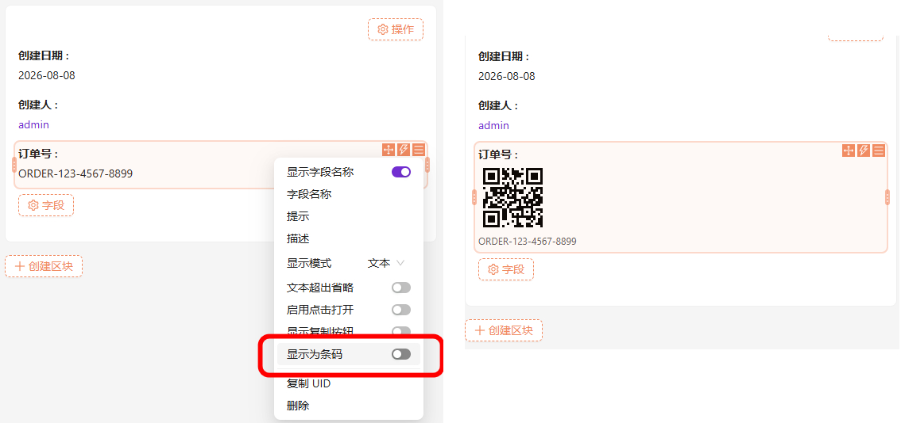
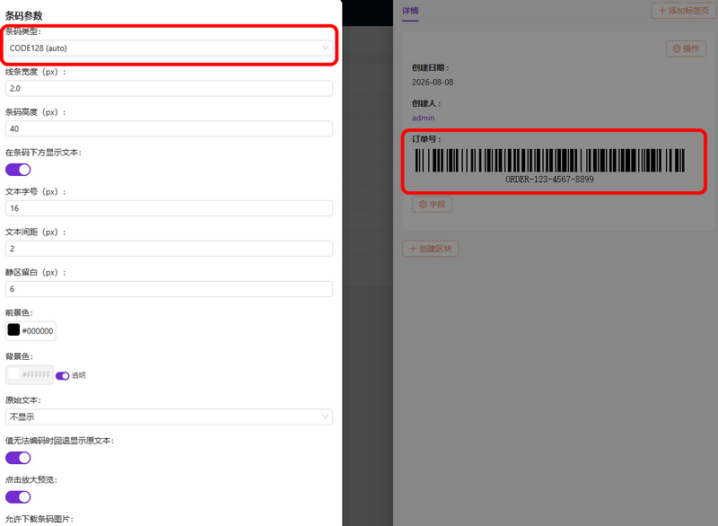

# 字段条码显示 / Field Barcode Display

`@simo/plugin-field-barcode`

将任意字段的值以**条码**或**二维码**的形式显示，**不改变数据库中的存储方式**。条码完全在浏览器本地生成，不调用任何外部接口，数据不出本地。

> 支持的码制：CODE128（A/B/C/auto）、CODE39、CODE93、EAN-13 / EAN-8 / EAN-5 / EAN-2、UPC-A / UPC-E、ITF / ITF-14、MSI（MSI10 / MSI11 / MSI1010 / MSI1110）、Pharmacode、Codabar，以及 QR Code。

---

## 效果图

---

## 功能特性

- **对存储零侵入**：插件只装饰字段的*显示渲染*，原始值始终按原样写入数据库；禁用插件后字段自动回退为普通文本显示。
- **全码制覆盖**：一维条码走 [JsBarcode](https://github.com/JsBarcode/JsBarcode)，二维码走 [qrcode-generator](https://github.com/kazuhikoarase/qrcode-generator)，覆盖零售、物流、医药、金融等常见场景。
- **全局默认值 + 字段级覆盖**：插件设置页统一配置默认参数，每个字段仍可在各自的「显示为条码」开关里单独覆盖。
- **本地生成**：所有 SVG 在浏览器端生成，无网络请求，可离线使用。
- **点击放大**：支持点击条码弹出大图预览，并可下载 **SVG / PNG**（PNG 通过离屏 Canvas 栅格化，打印清晰）。
- **中文二维码**：二维码分支已切换到 UTF-8 编码，中文 / Emoji 内容可正确编码。
- **优雅回退**：当值无法被所选码制编码时，可选择回退为原文本（带提示），或直接显示「条码值不合法」。
- **多值字段**：对 to-many / 数组类字段，每个条目渲染一个独立符号。
- **中英双语**：内置 `zh-CN` / `en-US` 文案，随 NocoBase 语言环境自动切换。

---

## 支持的条码类型

| 分组 | 码制 |
| --- | --- |
| 一维（1D） | CODE128 / CODE128A / CODE128B / CODE128C、CODE39、CODE93 / CODE93 (full ASCII)、EAN-13 / EAN-8 / EAN-5 / EAN-2、UPC-A / UPC-E、ITF / ITF-14、MSI / MSI10 / MSI11 / MSI1010 / MSI1110、Pharmacode、Codabar |
| 二维（2D） | QR Code（容错级别 L / M / Q / H） |

---

## 安装

本插件随 NocoBase 主工程以本地包方式安装，包名 `@simo/plugin-field-barcode`。

到 [Release 页](https://github.com/simousa/nocobase-plugin/releases)，下载对应的插件，在`nocobase`->`插件管理器`中启用插件。

> 插件首次安装后会自动创建数据表`simoBarcode`写入一行默认配置。

---

## 使用说明

### 1. 配置全局默认参数

进入 **管理后台 → 插件设置 → 条码显示**，在该页面设置所有字段共用的默认外观（码制、尺寸、颜色、文本等），并带有实时预览。配置仅作为默认值，单字段仍可在自身设置中覆盖。

*写入权限由 `pm.barcode-display` ACL 片段控制；所有登录用户默认可读取默认值。*

### 2. 在字段上开启条码显示

在任意数据表的字段「显示设置」中会出现 **显示为条码** 开关：

1. 打开开关，字段值即按所选码制渲染为条码 / 二维码；
2. 通过 **条码参数** 子项可针对该字段单独调整码制、颜色、尺寸等；
3. 适用于详情、弹窗、表格、列表等所有使用显示字段模型的位置。

### 3. 预览与下载

- 勾选「点击放大预览」后，点击条码弹出大图，并可在弹窗内下载 SVG / PNG；
- 「原始文本」选项可控制是否在条码旁 / 下方继续显示原文本。

---

## 配置项说明

| 配置项 | 说明 | 适用范围 |
| --- | --- | --- |
| 条码类型 `format` | 选择码制（见上表） | 全部 |
| 线条宽度 `barWidth` | 单根条宽（px） | 一维 |
| 条码高度 `barHeight` | 条码高度（px） | 一维 |
| 在条码下方显示文本 `displayValue` | 是否渲染可读字符 | 一维 |
| 文本字号 `fontSize` | 可读字符字号（px） | 一维 |
| 文本间距 `textMargin` | 可读字符与条的间距（px） | 一维 |
| 码点大小 `qrCellSize` | 二维码单模块尺寸（px） | 二维码 |
| 容错级别 `qrErrorLevel` | L(7%) / M(15%) / Q(25%) / H(30%) | 二维码 |
| 静区留白 `margin` | 符号四周留白（px） | 全部 |
| 前景色 `lineColor` | 条 / 模块颜色 | 全部 |
| 背景色 `background` | 背景色，支持透明 | 全部 |
| 原始文本 `originalTextMode` | 不显示 / 显示在条码右侧 / 显示在条码下方 | 全部 |
| 无法编码时回退原文本 `fallbackToText` | 编码失败时显示原文本而非报错 | 全部 |
| 点击放大预览 `clickToPreview` | 点击弹出大图 | 全部 |
| 允许下载图片 `downloadable` | 在预览弹窗内提供 SVG / PNG 下载 | 全部（依赖点击放大） |

---

## 工作原理

- **仅装饰，不替换字段模型**：插件通过 patch 内置 `ClickableFieldModel` / `DisplayEnumFieldModel` 的 `renderInDisplayStyle` 来拦截渲染，并把「显示为条码」作为 flow 步骤注入。这样做的好处是——一旦插件被禁用，存储的 flow 参数被自动忽略，字段干净地回退为原始文本渲染，不会出现「Model class not found」错误。
- **三层参数合并**：内置默认值 → 插件设置页全局默认值 → 字段级参数。字段仅覆盖其显式设置的项，未设置的项继承上层。
- **纯前端渲染 + 缓存**：`renderBarcode()` 在浏览器端生成 SVG，并对相同「值 + 参数」组合做内存缓存（上限 500 条），避免表格重绘时重复计算。
- **最小服务端**：服务端仅维护一行 `simoBarcodeConfig` 全局默认配置，并提供 `simoBarcodeSettings:get` / `:update` 资源读写，*绝不改写任何字段值*。

---

## 依赖

| 包 | 用途 |
| --- | --- |
| `jsbarcode` | 一维条码生成 |
| `qrcode-generator` | 二维码生成（已补 UTF-8 编码） |
| `react-i18next` | 多语言 |
| `@nocobase/client` / `@nocobase/client-v2` / `@nocobase/server`（peer） | NocoBase 2.x 运行时 |

---

## 感谢

感谢 一维条码 项目 [JsBarcode](https://github.com/JsBarcode/JsBarcode)

感谢 二维码 项目 [qrcode-generator](https://github.com/kazuhikoarase/qrcode-generator)

---

## 下载
https://github.com/simousa/nocobase-plugin/releases