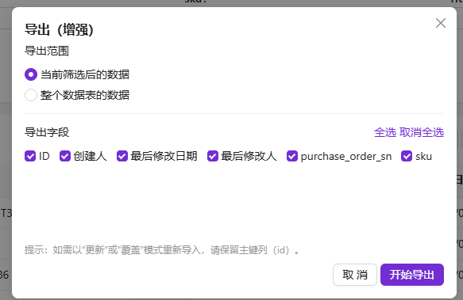

# @simo/plugin-import-export-enhancement

> 表格区块导入/导出增强 —— 自定义导出字段与范围、追加/更新/覆盖三种导入模式，以及一键下载导入模板。

## 简介

`@simo/plugin-import-export-enhancement` 是 NocoBase 2.x 的一个数据导入导出增强插件。它在表格区块上新增 **Export (Enhanced)（导出增强）** 与 **Import (Enhanced)（导入增强）** 两个动作，解决了官方导入导出在「字段选择、导出范围、导入更新策略」上的限制。

---

## 效果图

## 功能特性

### 增强导出（Export Enhanced）
- **字段级选择**：对话框中勾选要导出的字段（含关联字段的 `.` 路径，如 `author.name`）。
- **导出范围**：当前筛选后的数据 / 整个集合 / 选中的行（三选一）。
- **可配置「可导出字段」**：在动作设置齿轮中预先限定允许导出的字段白名单。
- 以 `xlsx` 二进制附件形式返回，文件名取自集合标题。

### 增强导入（Import Enhanced）
- **三种导入模式**：
  - **追加（append）**：忽略主键列，每行作为新记录创建。
  - **更新（update）**：按主键匹配已有记录，仅更新导入的字段列，其余字段保持不变。
  - **覆盖（overwrite）**：先删除当前筛选范围内（或整表）的记录，再写入表格数据（危险操作，带醒目警告）。
- **字段级选择**：仅导入勾选的普通字段（关联字段不可导入）。
- **类型擦除（coerce）**：根据字段类型自动转换单元格值（布尔、数值、日期、JSON/数组等）。
- **事务安全**：整个导入在数据库事务中执行，失败自动回滚；返回 `created/updated/skipped` 统计。
- **模板下载**：一键下载仅含表头的 `.xlsx` 模板，便于用户按格式填表。

## 安装

本插件随 NocoBase 主工程以本地包方式安装，包名 `@simo/plugin-import-export-enhancement`。

到 [Release 页](https://github.com/simousa/nocobase-plugin/releases)，下载对应的插件，在`nocobase`->`插件管理器`中启用插件。

> 本插件在构建期依赖 `xlsx`（声明于 `devDependencies`），需确保其可被打包进服务端 bundle。

## 依赖与环境

- **devDependencies**：`xlsx@^0.20.3`
- **peerDependencies**：`@nocobase/client@2.x`、`@nocobase/client-v2@2.x`、`@nocobase/server@2.x`、`@nocobase/test@2.x`
- **NocoBase 版本**：要求 `2.x`

## 使用说明

1. 在表格区块的工具栏「添加动作」中选择 **导出（增强）** / **导入（增强）**。
2. **导出**：点击动作 → 选择导出范围与字段 → 开始导出。
3. **导入**：点击动作 → 选择模式（追加/更新/覆盖）→ 勾选字段 →（可选）下载模板 → 拖入 xlsx → 开始导入。

## 下载
https://github.com/simousa/nocobase-plugin/releases