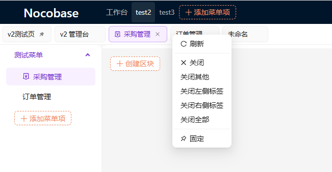
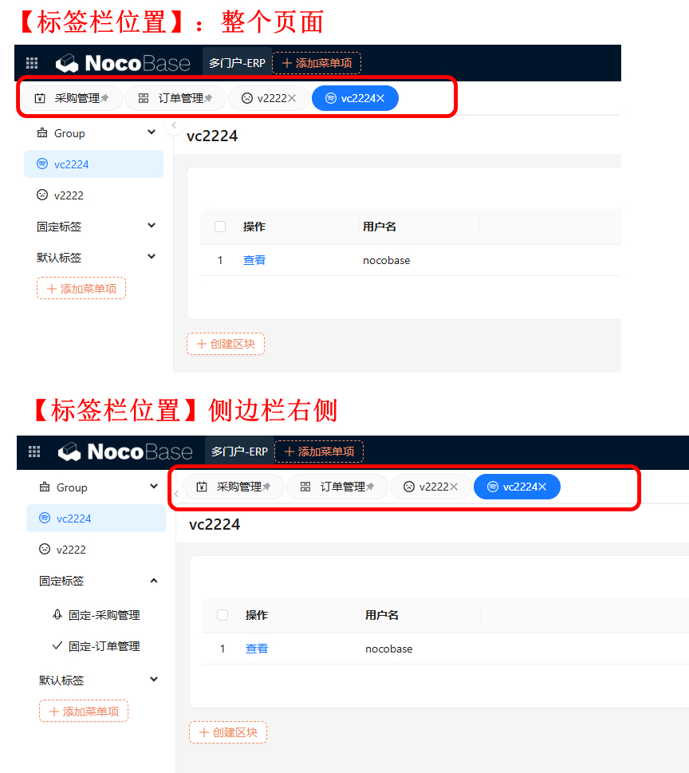
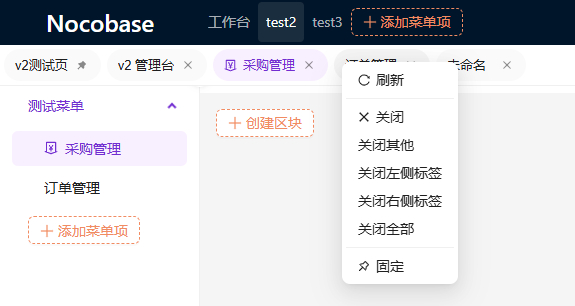
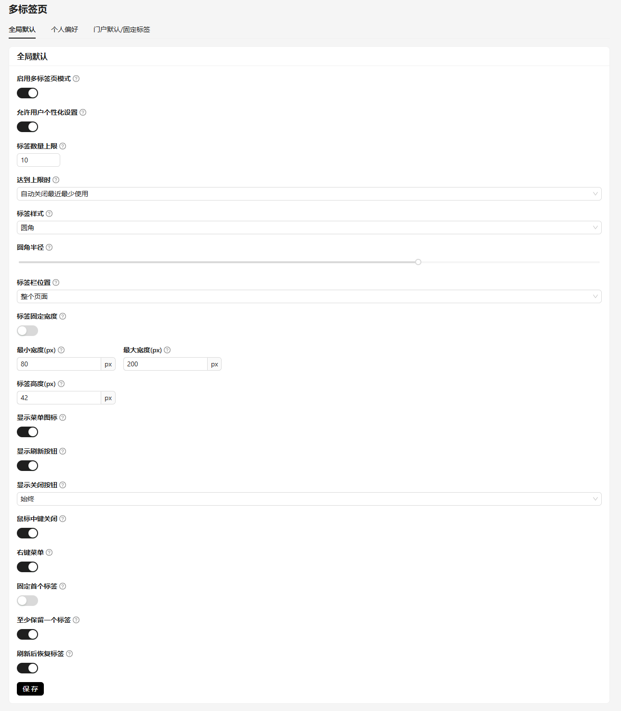

# @simo/plugin-multi-tabs

> NocoBase 多标签栏插件（client-v2）。为 NocoBase 后台增加类浏览器的多标签栏：支持全局默认配置、按门户设置默认/固定标签、以及每个用户在浏览器内的个人偏好。

---

## 一、简介

在 NocoBase 中，页面通常以**整页跳转**的方式切换，用户难以在多个页面之间快速往返。本插件在页面顶部（或侧边栏右侧）注入一个多标签栏，点击左侧菜单即在标签栏打开对应页面，支持关闭、固定、刷新、右键菜单等浏览器式交互。

插件把配置拆成 **三套相互隔离的作用域**，避免权限与数据互相污染：

| 作用域 | 配置入口（设置菜单 → Multi-tabs） | 存储位置 | 生效范围 | 权限片段 |
| --- | --- | --- | --- | --- |
| 全局默认（Global default） | `全局默认` | 数据表 `simoTabPageConfig.options` | 所有用户 | `pm.multi-tabs.global` |
| 个人偏好（Personal preferences） | `个人偏好` | 浏览器 localStorage（按门户命名空间） | 仅当前用户本人 | `pm.multi-tabs.personal` |
| 门户默认/固定标签（Portal） | `门户默认/固定标签` | 数据表 `simoTabPageConfig.portal_tab` | 对应门户的全部用户 | `pm.multi-tabs.portal` |

**优先级**：个人偏好（浏览器本地）> 全局默认；门户默认/固定标签只覆盖「默认标签 / 固定标签」两类，绝不覆盖个人偏好的样式、高度、行为等设置。

> 标签栏**只跟踪菜单级页面**。在页面内点击「查看」、打开弹窗/抽屉、应用筛选块、切换页内 `?tab=` 子标签等操作**不会**新建标签（避免无意义的标签堆积）。

---

## 效果图









---

## 二、功能特性

- 多标签栏：菜单级页面自动建标签，支持激活、关闭、关闭左右、关闭其他、关闭全部。
- 固定标签：管理员配置的全局/门户固定标签（始终存在、不可关闭）；用户也可右键固定/取消固定。
- 首标签固定（`pinFirstTab`）：固定第一个打开的页面。
- 刷新恢复（`restoreAfterRefresh`）：刷新后恢复之前打开的标签（依赖浏览器 localStorage）。
- 样式自定义：`card` / `rounded` / `underline` 三种外观，宽度与高度可调。
- 关闭交互：`closeButtonMode`（常显/悬停/激活时）、中键关闭、右键菜单。
- 标签页挂载位置：`page`（页面顶部整宽） / `sidebar`（侧边栏右侧）。
- 按门户隔离：不同门户拥有各自独立的默认/固定标签与本地标签状态。

---

## 三、安装与启用

1. 构建插件（`yarn build` 或 `pnpm build`），产物在 `dist/`。
2. 在 NocoBase 插件管理中启用 `@simo/plugin-multi-tabs`。
3. 启用后插件会**自动自愈**数据（见第七节），无需手工建表或迁移。
4. 在「设置 → Multi-tabs」下按需配置全局默认、门户默认/固定标签、个人偏好。

---

## 四、配置说明

### 4.1 三套配置的使用场景与方法

**① 全局默认（Global default）**
- 使用场景：管理员想给**所有用户**统一一套标签栏外观与行为（样式、高度、关闭策略、是否允许个人化、刷新是否恢复等）。
- 设置方法：设置 → Multi-tabs → `全局默认`，修改后点「保存」。写入数据表 `simoTabPageConfig.options`。

**② 个人偏好（Personal preferences）**
- 使用场景：最终用户希望在自己浏览器内微调标签栏（例如把高度调大、改成 underline 样式、开启中键关闭），**不影响其他用户**。
- 设置方法：设置 → Multi-tabs → `个人偏好`，修改后点「保存」。仅存浏览器 localStorage，随浏览器/设备生效。
- 前提：全局默认中 `allowPersonalization` 必须为开启（默认开启），否则个人偏好页不可编辑。

**③ 门户默认/固定标签（Portal default/fixed tabs）**
- 使用场景：系统部署了多门户（如 `/v/admin` 与 `/x/admin` 是两个不同门户），希望**每个门户**有不同的默认打开页与常驻固定标签，且对该门户所有用户统一生效。
- 设置方法：设置 → Multi-tabs → `门户默认/固定标签`，在下拉中选择门户（按 NocoBase 多门户的 `portalName` 识别），配置「默认标签 / 固定标签」后保存。写入数据表 `simoTabPageConfig.portal_tab`。
- 注意：下拉自动列出全部门户，无需「使用当前门户」按钮；标签路径只需是站内以 `/` 开头的路由，无需拼接部署子路径或域名。

### 4.2 全局默认配置项（逐项说明）

> 注：全局默认中**不再包含「默认标签 / 固定标签」**——这两项已移至「门户默认/固定标签」（见 4.1③）。全局 `options` 仍保留这两个字段（默认空数组），仅由门户配置驱动。

| 配置项 | 类型 / 取值 | 使用场景 | 设置方法 |
| --- | --- | --- | --- |
| `enabled` | boolean | 是否启用整个多标签栏；关闭后标签栏隐藏、页面恢复整页跳转。 | 全局默认开关 |
| `allowPersonalization` | boolean | 是否允许用户自定义个人偏好；关闭后个人偏好页只读。 | 全局默认开关（默认开启） |
| `maxTabs` | number（0=不限） | 限制同时打开的非固定标签数量，防止标签过多。 | 全局默认数字输入（默认 10） |
| `maxBehavior` | `lru` / `block` | 达到 `maxTabs` 上限时：`lru` 关闭最久未用的非固定标签；`block` 不再打开新标签。 | 全局默认下拉 |
| `style` | `card` / `rounded` / `underline` | 标签外观风格。 | 全局默认 / 个人偏好 |
| `fixedWidth` | boolean | 是否所有标签等宽。 | 全局默认 / 个人偏好 |
| `fixedTabWidth` | number(px) | `fixedWidth=true` 时每个标签的宽度（默认 160）。 | 全局默认 / 个人偏好 |
| `minTabWidth` / `maxTabWidth` | number(px) | `fixedWidth=false` 时标签自适应宽度的上下限（默认 80 / 200）。 | 全局默认 / 个人偏好 |
| `tabHeight` | number(px, ≥28) | 标签栏高度（默认 42）。 | 全局默认 / 个人偏好 |
| `roundedRadius` | number(px, 0–16) | `style=rounded` 时的圆角半径（默认 5）。 | 全局默认 / 个人偏好 |
| `showMenuIcon` | boolean | 是否在标签上显示菜单图标。 | 全局默认 / 个人偏好 |
| `showRefresh` | boolean | 是否在标签栏右侧显示刷新按钮。 | 全局默认 / 个人偏好 |
| `closeButtonMode` | `always` / `hover` / `active` | 关闭按钮显示时机：常显 / 悬停时 / 激活标签上。 | 全局默认 / 个人偏好 |
| `middleClickClose` | boolean | 是否支持鼠标中键点击关闭标签。 | 全局默认 / 个人偏好 |
| `contextMenu` | boolean | 是否启用右键菜单（固定 / 关闭左 / 关闭右 / 关闭其他 / 关闭全部）。 | 全局默认 / 个人偏好 |
| `pinFirstTab` | boolean | 固定第一个打开的页面（不可关闭）。若门户已配置默认/固定标签则该项不生效。 | 全局默认 / 个人偏好 |
| `keepAtLeastOne` | boolean | 是否至少保留一个标签（禁止关到空栏）。 | 全局默认 / 个人偏好 |
| `restoreAfterRefresh` | boolean | 刷新后是否恢复之前打开的标签（默认开启）。 | 全局默认 / 个人偏好 |
| `barPosition` | `page` / `sidebar` | 标签栏挂载位置：页面顶部整宽 / 侧边栏右侧。 | 全局默认 / 个人偏好 |

### 4.3 门户默认 / 固定标签

仅两个字段，按 `portalName` 分门户存储：

- `defaultTabs`：进入该门户时为每个用户默认打开的标签（`MultiTabItem[]`）。
- `pinnedTabs`：始终存在、不可关闭的固定标签（`MultiTabItem[]`）。

`MultiTabItem` 结构：

```ts
{
  title: string;          // 标签显示标题
  path: string;           // 完整路径（含部署 basename，如 /admin/pm/list）
  icon?: string;          // antd 图标名 或 菜单图标的 HTML 片段
  closable?: boolean;     // 是否可关闭
  pinned?: boolean;       // 是否固定
}
```

> 某门户未单独配置时，该门户没有默认/固定标签（回退为空），仅按用户个人操作与全局行为生效。

### 4.4 个人偏好可自定义字段

个人偏好可覆盖以下 15 项（不含默认/固定标签，因标签由管理员按门户统一配置）：`style`、`fixedWidth`、`fixedTabWidth`、`minTabWidth`、`maxTabWidth`、`tabHeight`、`roundedRadius`、`showMenuIcon`、`showRefresh`、`closeButtonMode`、`middleClickClose`、`contextMenu`、`pinFirstTab`、`keepAtLeastOne`、`barPosition`。

---

## 五、数据表说明

插件使用**单行长记录**的数据表，所有全局配置与门户配置都在这一行内。

- **表名**：`simoTabPageConfig`（标题 `Multi-tab Global Config`）
- **字段**：

| 字段名 | 类型 | 说明 | 结构 |
| --- | --- | --- | --- |
| `options` | JSON | 全局默认配置（见 4.2 全部字段） | `MultiTabConfig` 对象 |
| `portal_tab` | JSON | 按门户的默认/固定标签 | `{ portals: { [portalName]: { defaultTabs: MultiTabItem[]; pinnedTabs: MultiTabItem[] } } }` |

- `options` 示例：

```json
{
  "enabled": true,
  "allowPersonalization": true,
  "maxTabs": 10,
  "maxBehavior": "lru",
  "style": "card",
  "fixedWidth": false,
  "fixedTabWidth": 160,
  "minTabWidth": 80,
  "maxTabWidth": 200,
  "tabHeight": 42,
  "roundedRadius": 5,
  "showMenuIcon": true,
  "showRefresh": true,
  "closeButtonMode": "always",
  "middleClickClose": true,
  "contextMenu": true,
  "pinFirstTab": false,
  "keepAtLeastOne": true,
  "restoreAfterRefresh": true,
  "barPosition": "page",
  "defaultTabs": [],
  "pinnedTabs": []
}
```

- `portal_tab` 示例：

```json
{
  "portals": {
    "erp": {
      "defaultTabs": [{ "title": "仪表盘", "path": "/admin/dashboard", "icon": "DashboardOutlined" }],
      "pinnedTabs": [{ "title": "订单", "path": "/admin/orders", "icon": "ShoppingCartOutlined" }]
    }
  }
}
```

---

## 六、权限片段（ACL）

| 片段名 | 对应动作 | 说明 |
| --- | --- | --- |
| `pm.multi-tabs.global` | `simoTabPageConfig:update` | 允许编辑全局默认配置（写 `options`） |
| `pm.multi-tabs.portal` | `simoTabPageConfig:updatePortal` | 允许按门户编辑默认/固定标签（写 `portal_tab`） |
| `pm.multi-tabs.personal` | （无服务端资源） | 纯客户端门控，控制用户能否编辑个人偏好 |

- 旧片段名 `pm.multi-tab.global` / `pm.multi-tab.personal` **仍兼容**，已注册，既有角色授权无需重新分配。
- 读取（`list` / `get`）对所有登录用户开放，保证默认配置对所有人生效。

---

## 七、升级与数据自愈

插件在 `load` / `install` / `afterEnable` 时会自动：

1. **建表加列（`ensureSchema`）**：调用 NocoBase `Collection.model.sync({ alter: { drop: false } })`，仅新增/修改列、绝不删列。解决升级后 `portal_tab` 列缺失导致的 `Invalid SQL column or table reference`。
2. **归一化旧数据（`migrateOptions`）**：把历史版本的 `options` JSON 迁移到当前 schema——补齐缺失键（如 `allowPersonalization`）、丢弃旧键（如 `portals`）。迁移是幂等且不破坏真实配置的，升级后**无需管理员手工保存**即可让个人偏好生效。
3. **保证存在默认行（`ensureRow`）**：若无记录则按 `DEFAULT_GLOBAL_CONFIG` 创建一行。

---

## 八、常见问题

- **Q：从旧版本升级后个人偏好不生效？** A：升级后插件会自动归一化 `options`，无需手工保存；若仍不生效，确认全局 `allowPersonalization` 已开启、且用户角色拥有 `pm.multi-tabs.personal`。
- **Q：刷新后标签没恢复？** A：确认 `restoreAfterRefresh` 已开启；恢复依赖浏览器 localStorage（按门户命名空间），清除浏览器数据或更换设备不会跨设备恢复。
- **Q：弹窗/查看/筛选会多出标签？** A：不会。这些属于页面内 overlay 操作，标签栏只跟踪菜单级页面。
- **Q：不同门户标签串了？** A：标签与默认/固定标签均按门户 `portalName` 隔离，切换门户只显示该门户的标签。

---

## 下载
https://github.com/simousa/nocobase-plugin/releases