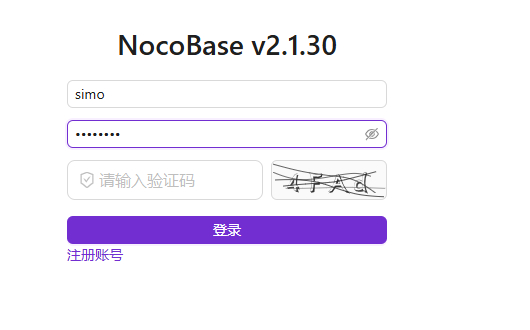
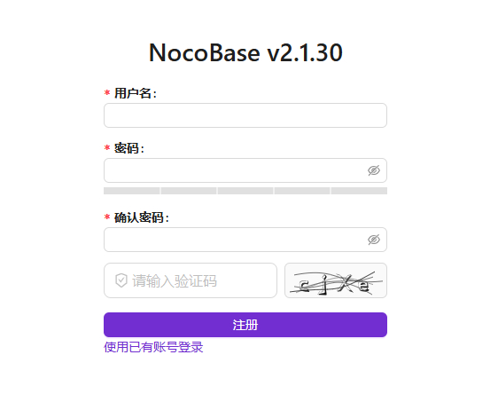
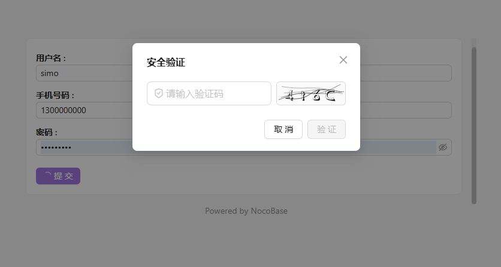

# @simo/plugin-verification-code

> 本地生成的图片/算术验证码（CAPTCHA）—— 集成 NocoBase 官方验证插件，保护登录、注册、忘记密码与公开表单，防范爬虫/机器人批量提交数据。

## 简介

`@simo/plugin-verification-code` 是 NocoBase 2.x 的一个验证码插件。它在官方 `@nocobase/plugin-verification` 之上注册了一种新的验证类型 **`image-captcha`（图片验证码）**，在用户登录、注册、找回密码以及公开表单提交时强制人机校验。

所有验证码均在 **服务器本地生成，不调用任何第三方 API**（`svg-captcha` 优先，缺失时回退到内置零依赖生成器），特别适合对数据出境有合规要求的私有化部署。

---

## 效果图

## 功能特性

### 验证码生成
- **两种类型**：字符验证码（字母+数字）/ 算术题验证码（`3 + 5 = ?`）。
- **字符集**：字母+数字 / 仅字母 / 仅数字。
- **排除易混淆字符**：可排除 `0/o/O`、`1/i/l/I`、`9/g/q` 等。
- **外观可配置**：干扰线数量、是否彩色字符、宽度/高度/字号、背景色。
- **本地生成 + 实时预览**：管理员在验证器设置中可实时预览效果。

### 保护场景（可独立开关）
- 登录页面（Sign-in）
- 注册页面（Sign-up）
- 忘记密码页面（Forgot password）
- 公开表单提交（Public forms）

### 安全策略
- **验证码有效期**：默认 300 秒，过期需刷新。
- **单 IP 限流**：默认每分钟 30 次生成上限，防刷接口。
- **一次性使用**：验证码在首次校验后立即作废（无论成功失败），用户看不清可点击图片换一张。
- **大小写不敏感**：答题统一小写比对，并使用 `crypto.timingSafeEqual` 防时序攻击。
- **答案不出服务端**：生成时仅返回图片与 id，正确答案仅存于服务端缓存。

### 客户端守卫
- **axios 请求/响应拦截器**：对受保护接口（登录/注册/忘记密码/`*publicSubmit`）自动附加 `X-Captcha-Id` / `X-Captcha-Code` 头；响应后清除并刷新凭证。
- **登录页内联组件注入**：通过 `MutationObserver` 在登录/注册/找回密码页面注入验证码组件（纯 DOM + 独立 React root，不依赖 app Provider）。
- **模态兜底**：公开表单提交等无内联组件场景，弹出验证码弹窗。

### 存储
- 优先使用 NocoBase `cacheManager`（多实例部署下支持 Redis 共享）；不可用时回退到进程内内存存储。

## 安装

本插件随 NocoBase 主工程以本地包方式安装，包名 `@simo/plugin-verification-code`。

到 [Release 页](https://github.com/simousa/nocobase-plugin/releases)，下载对应的插件，在`nocobase`->`插件管理器`中启用插件。

> 本插件依赖官方 `@nocobase/plugin-verification`（已声明于 `pluginDependencies` 与 `peerDependencies`）。

## 依赖与环境

- **dependencies**：`svg-captcha@^1.4.0`
- **pluginDependencies**：`@nocobase/plugin-verification`
- **peerDependencies**：`@nocobase/client@2.x`、`@nocobase/client-v2@2.x`、`@nocobase/server@2.x`、`@nocobase/test@2.x`、`@nocobase/plugin-verification@2.x`
- **NocoBase 版本**：要求 `2.x`

## 使用说明

1. 启用官方 `验证码` 插件与本插件。
2. 进入「验证码」管理，新建 `image-captcha` 类型验证器。
3. 在设置中勾选需要保护的场景（登录/注册/忘记密码/公开表单），并配置验证码类型、字符集、外观与安全策略。
4. 配置保存后，受保护页面将自动要求输入验证码，接口层由中间件强制校验。

---

## 下载
https://github.com/simousa/nocobase-plugin/releases